### boxing and unboxing in c#

[boxing and un boxing ](https://medium.com/@jaimin_99136/boxing-and-unboxing-in-net-c-1aeda6d28e5c#:~:text=In%20C%23%2C%20boxing%20and%20unpacking,into%20a%20Reference%20Type%20variable.)

[boxing examples](https://medium.com/@ozkanardil/what-are-boxing-and-unboxing-in-c-71fb8e988689)

#### reflection

[link for reflection](https://dotnetfullstackdev.medium.com/what-is-reflection-in-c-86240d96d8b4)

## types of c#

1. value or null type

* if we want to change inull , true or false we get the values 

```
using System;
using System.Runtime.InteropServices;
namespace typesofcsharp
{
    class Program
    {
        static void Main()
        {
            bool? AreYouMajor = false;
            if (AreYouMajor == true)
            {
                Console.WriteLine("user is major");     
            }
            else if (AreYouMajor == false)
                {
                Console.WriteLine("user is not major");
            }
            else
            {
                Console.WriteLine("user is DispIdAttribute not answer the question");
            }

        }
    }
}
```
```
using System;
using System.Runtime.InteropServices;
namespace typesofcsharp
{
    class Program
    {
        static void Main()
        {
            int? TicketOnSale = 100;
            int AvailableTickets = TicketOnSale ?? 0;
            //int AvailableTickets;
            //if (TicketOnSale != null)
            //{
            //    AvailableTickets = 0;
            //}
            //else
            //{
            //    AvailableTickets = (int)TicketOnSale;
            //}
            Console.WriteLine("Available tickets ={0}" , AvailableTickets);
        }
    }
}
```
### types of data conversion

* impliciteconverasation
```
using System;
using System.Runtime.InteropServices;
namespace typesofcsharp
{
    class Program
    {
        static void Main()
        {
            int i =10 ;
            float f = i;
            Console.WriteLine(f);
        }
     
    }
}
```
* explicity conversation
```
using System;
using System.Runtime.InteropServices;
namespace typesofcsharp
{
    class Program
    {
        static void Main()
        {
            string strNumber = "100";
            int i = int.Parse(strNumber);
            Console.WriteLine(i);
            string stgNumber1 = "9985";
            //string stgNumber1 = "100TB";
            int result = 0;
            bool IsConversionSuccecessful = int.TryParse(stgNumber1, out result);
            if(IsConversionSuccecessful)
            {
                Console.WriteLine(result);
            }
            else
            {
                Console.WriteLine("please enter a valid number");
            }


        }
    }
}
```
### 
array
```
using System;
using System.Runtime.InteropServices;
namespace typesofcsharp
{
    class Program
    {
        static void Main()
        {
            int[] EvenNumbers = new int[3];
            EvenNumbers[0] = 1;
            EvenNumbers[1] = 2;
            EvenNumbers[2] = 199;
            Console.WriteLine(EvenNumbers[1]);
        }
    }
}
```
### single and mulutiline comments (cntl=k;cntl+u;cntl+c)

```
using System;
using System.Runtime.InteropServices;
namespace typesofcsharp
{
   // class Program
    {
        static void Main()
        {
           /* int[] EvenNumbers = new int[3];
            EvenNumbers[0] = 1;
            EvenNumbers[1] = 2;
            EvenNumbers[2] = 199;
            Console.WriteLine(EvenNumbers[1]);*/
        }
    }
}
```


2. reference or non nullable type

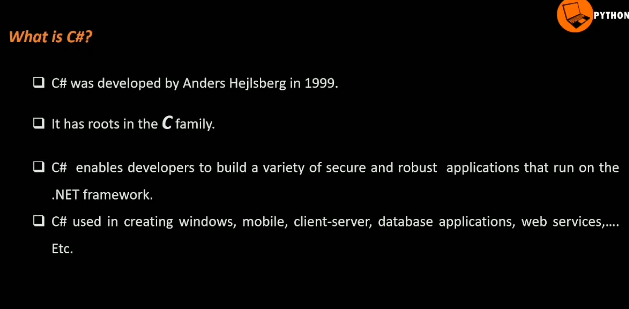

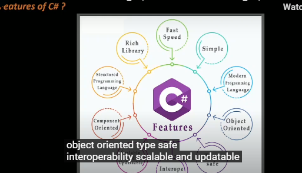

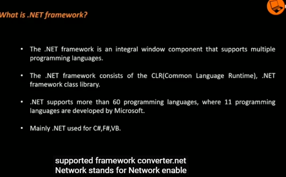

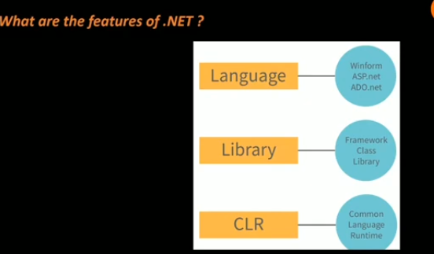

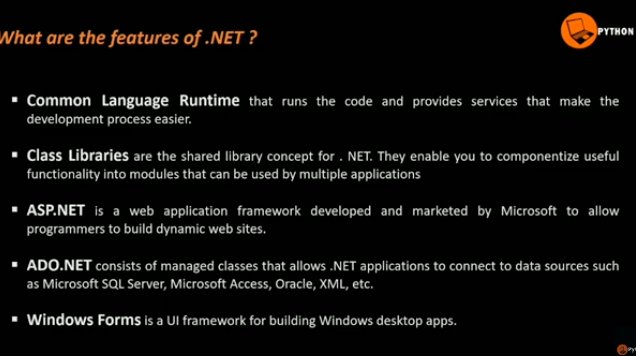


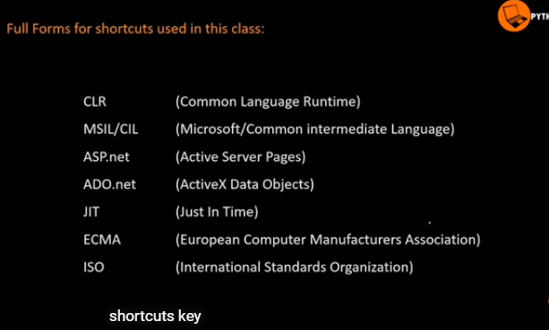

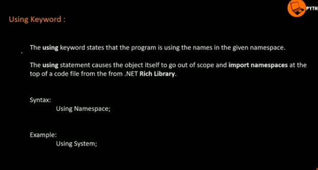


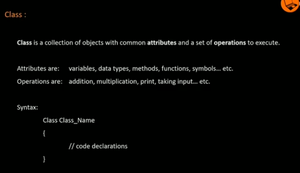

### visual studio 

* create project >> solution name & project name 

* right click on solution >> add>> create number of projects 

* In one solution containes number of projects

```hello.cs

using System; //console.writeline or read line already execueted //

namespace MyApp //objects classes or methods ni oka container loa place cheyatanni name space use cheastam, multiple features ni apply cheayalamtea a feacture ki a feature specific name estam//
{
    internal class Program ////
    {
        static void Main(string[] args) //main function//
        {
            Console.WriteLine("welcome to python life");
            
        }
    }
}

```
* class <classname>: collection of objects

* static:  with out object also we call's any class , variables and method (object used for calls var)

* void: don't expect the any output

* main: 

* string[]args :  zero args also program executes 

* Console.Write: print the output 

* Console.Writeline : print the output in next printed value


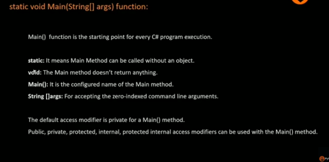

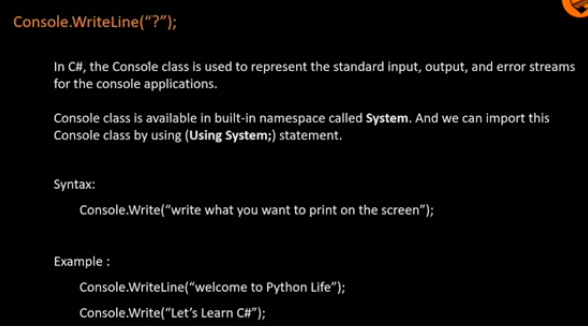

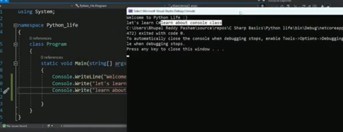

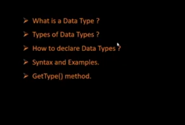

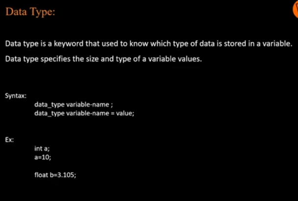

* string: string is a combination of charectores


```.cs
using System;

namespace MyApp
{
    internal class Program
    {
        static void Main(string[] args)
        {
            Console.WriteLine("welcome to python life");
            int a = 10;
            Console.WriteLine(a);
            float b = 23.5f;
            Console.WriteLine(b.GetType());
            bool n = true;
            Console.WriteLine(n.GetType());
            char c = 'a';
            Console.WriteLine('a'.GetType());
            string s = "welcome to c-sharp";
           // Console.WriteLine(s.GetType());
            Console.ReadLine(s.GetType());
            
        }
    }
}
```

### for loop

```
using System;
using System.Runtime.InteropServices;
namespace typesofcsharp
{
    class Program
    {
        static void Main()
        {
            for (int  i=0; i<=20; i++)
            {
                if(i%2 == 1)
                    continue;
                Console.WriteLine(i);
            }
        }
    }
}
```
### accessability

```
using System;
using System.Runtime.InteropServices;
namespace typesofcsharp
{
    class Program
    {
        public static void Main()
        {
            Program.EvenNumbers();
            
            }
        public static void EvenNumbers()
        {
            int Start = 0;
            while(Start <=20)
            {
                Console.WriteLine(Start);
                Start = Start + 2;
            }

        }

        }
    }
```


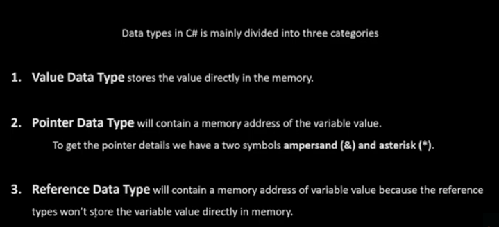

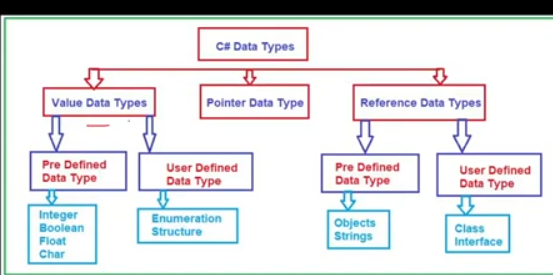

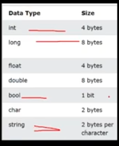


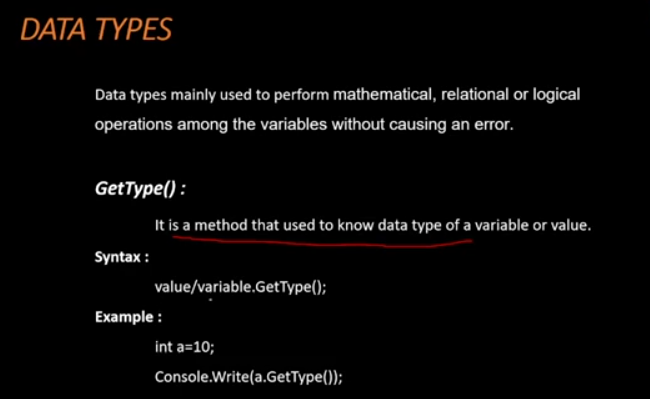

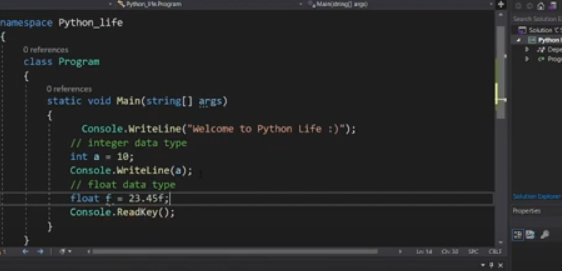

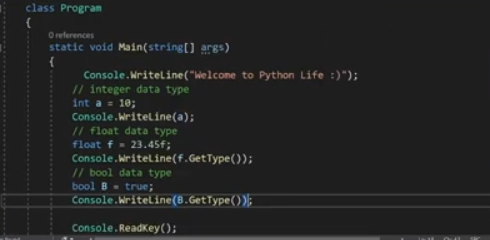

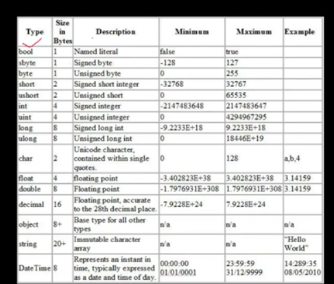

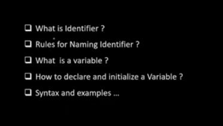

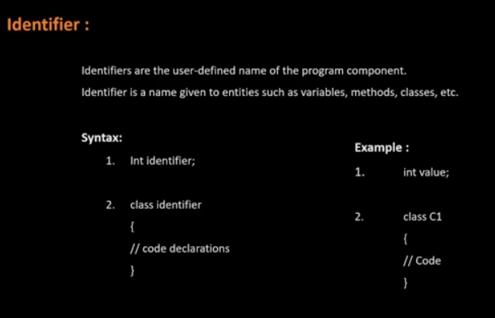

* int identifier; (int: data type , identifier= variablename or value)

*  case = variables 

CASE ,case those are okay , but Case its not correct  

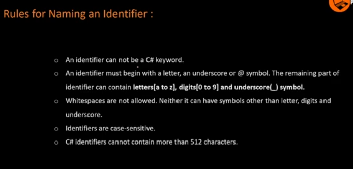

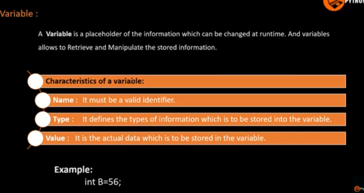

* int =datatype 

* B= variable

* value=56

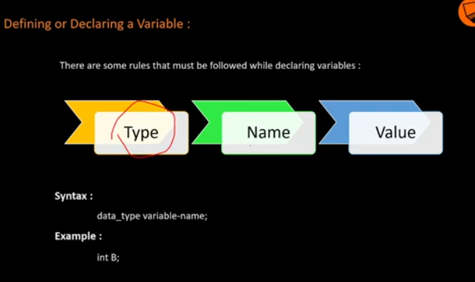


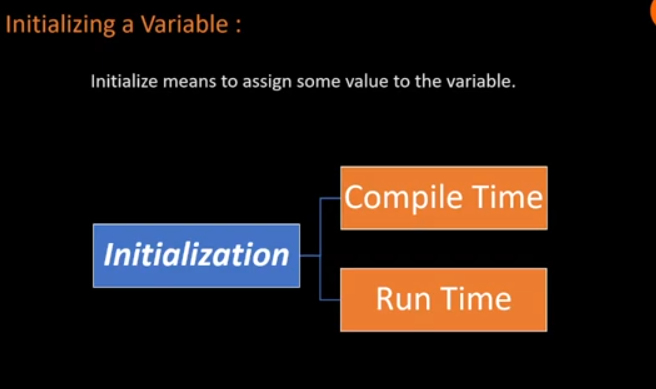

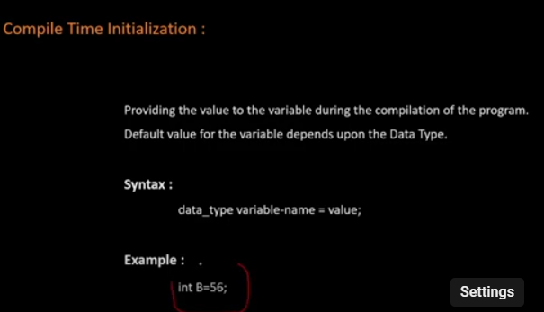

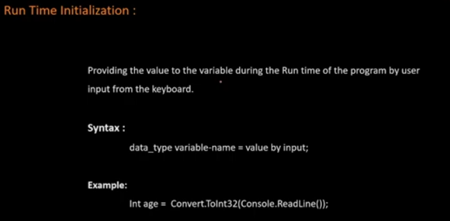

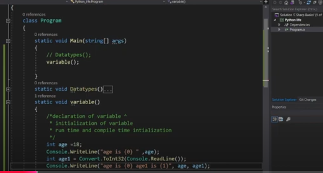

```age.py
using System;
using System.Runtime.CompilerServices;
class program
{
    static void Main (string[] args)
    {
        variable();
    }
    static void variable()
    {
        int age = 30;
        Console.WriteLine("print age is{0} ",age);
        int age1 = Convert.ToInt32(Console.ReadLine());
        Console.WriteLine("age is {0} age1 is {1}", age , age1);
    }
}

o/p: 
print age is30
41
age is 30 age1 is 41
```


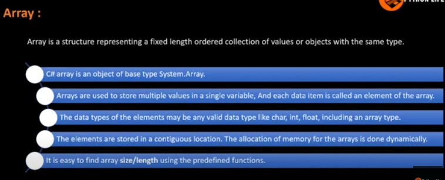

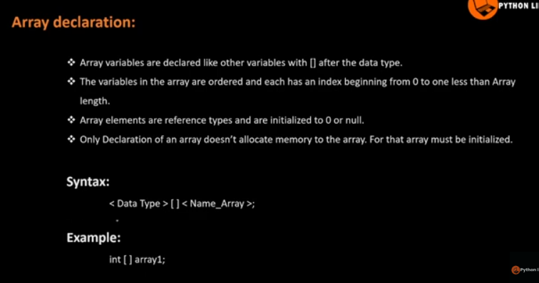

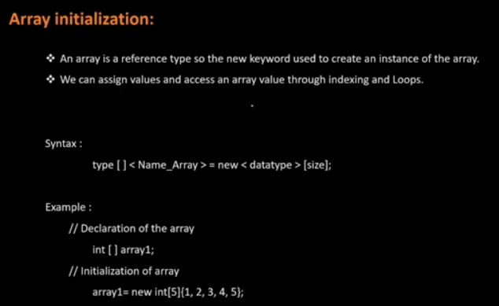

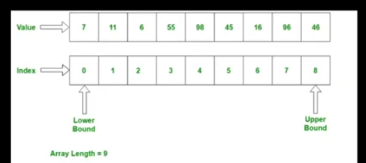

### one dimentional array

```
using System;
using System.Runtime.CompilerServices;
class program
{
    static void Main (string[] args)
    {
        array();
    }
    static void array()
    {
        int[] intArray1 = new int[5];
        foreach (int a in intArray1)
            Console.WriteLine(a + " ");
        Console.WriteLine();
        int[] intArray2 = new int[5] { 1,5,71,83,90};
        foreach(int b in intArray2)
            Console.WriteLine(b + " ");
        Console.WriteLine();
        int[] intArray3 = { 88, 22, 53 };
        Console.WriteLine("one Dimentional array :");
        foreach (int d in intArray3)
            Console.Write(d + " ");
        Console.WriteLine();       
    }
}
o/p:
0
0
0
0
0

1
5
71
83
90

one Dimentional array :
88 22 53
```

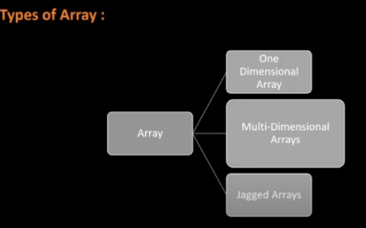


### 2 dimentional
```
using System;
using System.Runtime.CompilerServices;

class Program
{
    static void Main(string[] args)
    {
        array();
    }

    static void array()
    {
        // Initialize a 2D array with dimensions [3, 2]
        int[,] _2D = new int[,] { { 3, 4 }, { 1, 4 }, { 2, 4 } };

        Console.WriteLine("2D array elements:");

        // Loop through the rows (3 rows)
        for (int i = 0; i < 3; i++)
        {
            // Loop through the columns (2 columns)
            for (int j = 0; j < 2; j++)
            {
                // Print the value at _2D[i, j]
                Console.Write(_2D[i, j] + " ");  // Using a space to separate the values in each row
            }
            Console.WriteLine();  // Move to the next line after printing each row
        }
    }
}

o/p:
2D array elements:
3 4
1 4
2 4
```

### 3 dimentional

```
using System;
using System.Runtime.CompilerServices;

class Program
{
    static void Main(string[] args)
    {
        array();
    }

    static void array()
    {
        int[,,] _3D = new int[,,] { { { 1, 2, 3 }, { 2, 3, 4 }, { 3, 4, 5 }, { 4, 5, 6 } } };

        Console.WriteLine("3D elements:");
        for (int i = 0; i < 4; i++)
        {
            for (int j = 0; j < 3; j++)
                for (int k = 0; k < 3; k++)
            {
                // Access the elements properly
                Console.WriteLine($"i = {i}, j = {j}, k = {k},value = {_3D [i, j,k]}");
            }
        }
        Console.WriteLine();
    }
}

o/p:
3D elements:
i = 0, j = 0, k = 0,value = 1
i = 0, j = 0, k = 1,value = 2
i = 0, j = 0, k = 2,value = 3
i = 0, j = 1, k = 0,value = 2
i = 0, j = 1, k = 1,value = 3
i = 0, j = 1, k = 2,value = 4
i = 0, j = 2, k = 0,value = 3
i = 0, j = 2, k = 1,value = 4
i = 0, j = 2, k = 2,value = 5
```

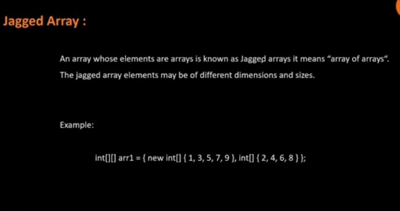

### jagged array

```
using System;

class Program
{
    static void Main(string[] args)
    {
        array();
    }

    static void array()
    {
        // Initialize the jagged array
        int[][] J_A = new int[2][];
        J_A[0] = new int[5] { 1, 5, 4, 8, 9 };
        J_A[1] = new int[4] { 2, 2, 6, 7 };  // This sub-array has 4 elements

        Console.WriteLine("Jagged array elements:");

        // Iterate through each array in the jagged array
        for (int i = 0; i < J_A.Length; i++)
        {
            Console.WriteLine("Array " + i + ":");

            // Iterate through each element in the i-th array
            for (int j = 0; j < J_A[i].Length; j++)
            {
                Console.WriteLine("Element [" + i + "," + j + "] = " + J_A[i][j]);
            }
        }
    }
}

Jagged array elements:
Array 0:
Element [0,0] = 1
Element [0,1] = 5
Element [0,2] = 4
Element [0,3] = 8
Element [0,4] = 9
Array 1:
Element [1,0] = 2
Element [1,1] = 2
Element [1,2] = 6
Element [1,3] = 7

```

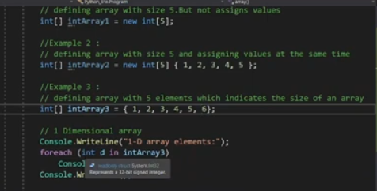

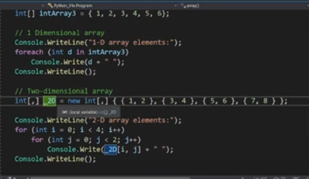

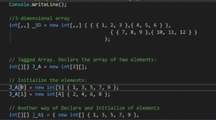

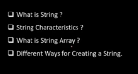

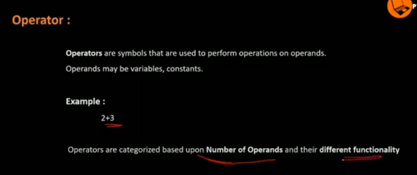

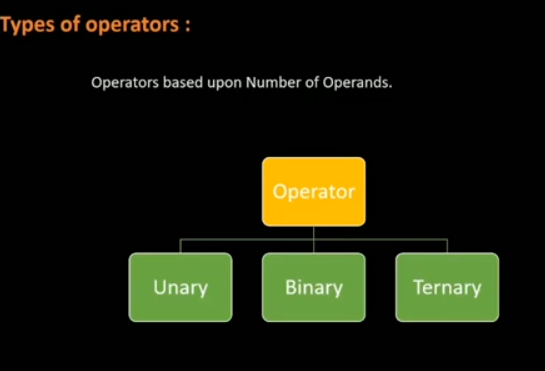

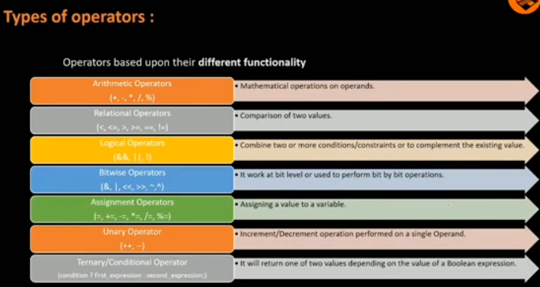

### arthematic , relational operators
```
using System;

class Program
{
    static void Main(string[] args)
    {
        operators();
    }
    static void operators()
    {
        int a = 25;
        int b = 5;
        Console.WriteLine(a + b);
        Console.WriteLine(a - b);
        Console.WriteLine(a / b);
        Console.WriteLine(a % b);
        Console.WriteLine(a * b);
        Console.WriteLine("relational operators");
        Console.WriteLine(a = b);
        Console.WriteLine(a < b);
        Console.WriteLine(a > b);
        Console.WriteLine(a <= b);

    }
       
}

o/p:
30
20
5
0
125
relational operators
5
False
False
True
```

### assignment operator

```
using System;

class Program
{
    static void Main(string[] args)
    {
        operators();
    }
    static void operators()
    {
        int a = 25;
        int b = 5;       
        Console.WriteLine("assignment  operators");       
        Console.WriteLine(a = b);
        Console.WriteLine(a += b);
        Console.WriteLine(a-= b);
    }
       
}
o/p:
assignment  operators
5
10
5

```
### increment operator
```
using System;

class Program
{
    static void Main(string[] args)
    {
        operators();
    }
    static void operators()
    {
        int a = 25;
        int b = 5;       
        Console.WriteLine("incrementt  operators");       
        Console.WriteLine(a = b);
        Console.WriteLine(a += b);
        Console.WriteLine(a-= b);

        Console.WriteLine(a++);
        Console.WriteLine(a);
        Console.WriteLine(++a);
    }
       
}
o/p:
incrementt  operators
5
10
5
5
6
7
```
### ternary operator
```
using System;

class Program
{
    static void Main(string[] args)
    {
        operators();
    }
    static void operators()
    {
        int a = 25;
        int b = 5;       
        Console.WriteLine("unary operator");
        Console.WriteLine(a > b ? b : a);
    }
       
}


o/p: incase a>b then its true ; prints b value 
unary operator
5
```
### logical operator

```
using System;

class Program
{
    static void Main(string[] args)
    {
        operators();
    }
    static void operators()
    {
        int a = 25;
        int b = 5;       
        Console.WriteLine("logical operator");
        Console.WriteLine(a > b && a < b);
        Console.WriteLine(a > b || a < b);
    }
       
}

o/p:
logical operator
False
True
```

### ternary operator

* not equalto true means it takes flase option automatically 

```
using System;

class Program
{
    static void Main(string[] args)
    {
        operators();
    }
    static void operators()
    {
        int a = 25;
        int b = 5;       
        Console.WriteLine("ternary operator");
        bool t = true;
        Console.WriteLine(!t);
    }
       
}

o/p:
ternary operator
False
```

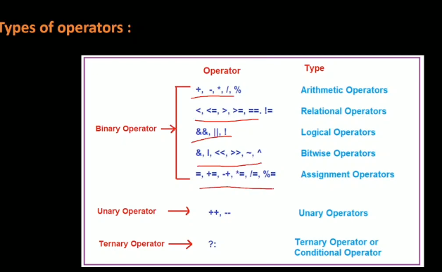

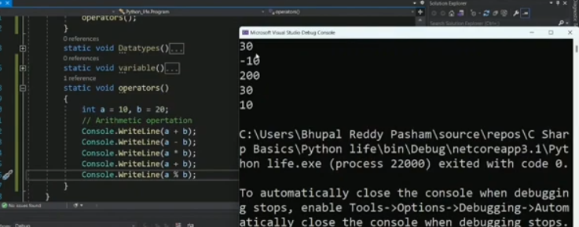

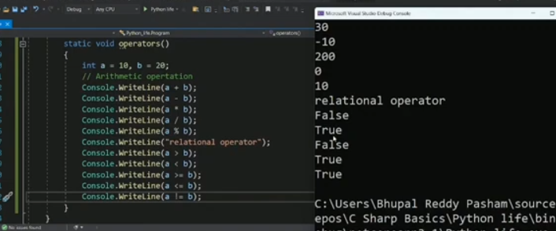

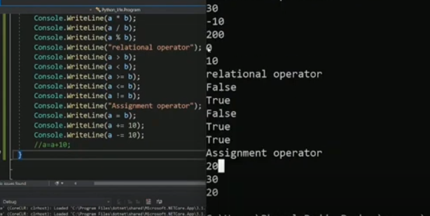

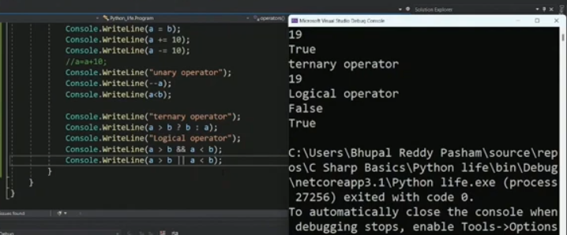

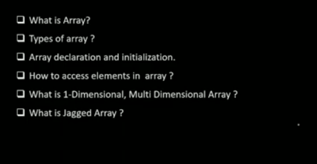

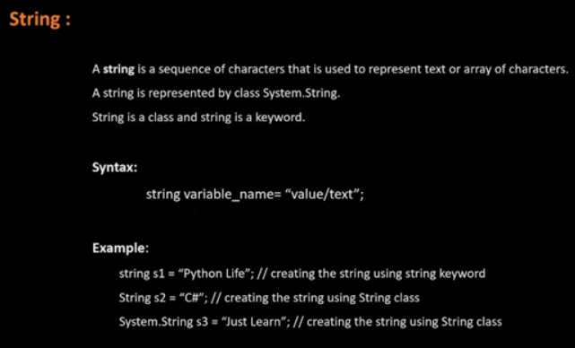

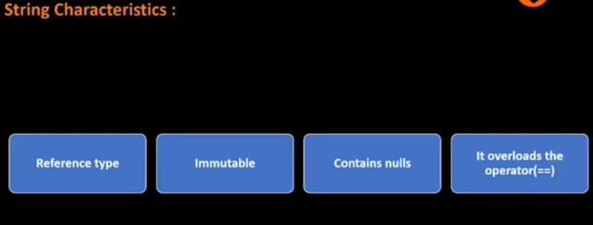


### string

* String used as class (capital "S")

* string is a keyword (small "s")

* syntax:

        string[] variable_name = "value/text"

##### reference type

* once we enter the data , its not stored directly to the memory ; its saves the memory path where address file

##### immutable

* once we declare we cannot change another time


##### containes null:


##### i overloads the operator (==):

polymorphysum we used some over loading 


* to creating string using concadination one variable adds the another variable by using '+'  symbol

```
using System;

namespace MyApp
{
    internal class Program
    {
        static void Main(string[] args)
        {
            Strings();
        }
        static void Strings()
        {
            string a = "wecome to 42443";
             Console.WriteLine(a);
            
        }
    }
}
o/p:
wecome to 42443
```

```
using System;

namespace MyApp
{
    internal class Program
    {
        static void Main(string[] args)
        {
            Strings();
        }
        static void Strings()
        {
            string a = "wecome to 42443";
             Console.WriteLine(a);
            // array variable 
            string[] b = new string[4]; // we declare firt with array size
            b[0] = "hey ram";
            b[1] = "how are you yar";
            b[2] = "by the way this is your mobile! ";
            b[3] = "9966445588";
            for (int i = 0;i<4; i++)
                Console.WriteLine(b[i]);
            
        }
    }
} 
o/p:
wecome to 42443
hey ram
how are you yar
by the way this is your mobile!
9966445588
```
* we add some string byy using + symbole for concatiation (to modify )

```
using System;

namespace MyApp
{
    internal class Program
    {
        static void Main(string[] args)
        {
            Strings();
        }
        static void Strings()
        {
            string a = "wecome to 42443";
             Console.WriteLine(a);
            // array variable 
            string[] b = new string[4]; // we declare firt with array size
            b[0] = "hey ram";
            b[1] = "how are you yar";
            b[2] = "bythe way this is your mobile! ";
            b[3] = "9966445588";
            for (int i = 0;i<4; i++)
                Console.WriteLine(b[i]);

            // concotination 

            string abc = b[2] + b[1]+" is good";
            Console.WriteLine(abc);
            
        }
    }
}
o/p:
wecome to 42443
hey ram
how are you yar
bythe way this is your mobile!
9966445588
bythe way this is your mobile! how are you yar is good
```
```concadination
using System;

namespace MyApp
{
    internal class Program
    {
        static void Main(string[] args)
        {
            Strings();
        }
        static void Strings()
        {
            string a = "wecome to 42443";
             Console.WriteLine(a);
            // array variable 
            string[] b = new string[4]; // we declare firt with array size
            b[0] = "hey ram";
            b[1] = "how are you yar";
            b[2] = "bythe way this is your mobile! ";
            b[3] = "9966445588";
            for (int i = 0;i<4; i++)
                Console.WriteLine(b[i]);

            // concotination 

            string abc = b[2] + b[1]+" is good";
            Console.WriteLine(abc);
            int t = 100;
            string f = String.Format("{0}{1}", a, t.ToString());
            Console.WriteLine(f);
            
        }
    }
}
o/p:
wecome to 42443
hey ram
how are you yar
bythe way this is your mobile!
9966445588
bythe way this is your mobile! how are you yar is good
wecome to 42443100
```
```
using System;

namespace MyApp
{
    internal class Program
    {
        static void Main(string[] args)
        {
            Strings();
        }
        static void Strings()
        {
            Console.WriteLine("enter your name");
            string name = Console.ReadLine();
            Console.WriteLine(name);

        }
    }
}
o/p:
enter your name
<hema>
hema
```


*  create a string by Formate : in string class we have formate method , from this formate through also we  create a string ,

* by using for loops and creating the string (user-input)


* IMPLICITE: small datatype converted to large data type(int a=10 ; string b = Convert.ToString(a);)

string = variable
Convert = class
toString = datatype

* EXPLICIT : large data type to small data type ()


```implicit no dataloss
using System;

namespace MyApp
{
    internal class Program
    {
        static void Main(string[] args)
        {
            TypeConversion();
        }
        static void TypeConversion()
        {
            int a = 10;
            float b = a;
            Console.WriteLine(b);
       

        }
    }
}
o/p:
10

```
```
using System;

namespace MyApp
{
    internal class Program
    {
        static void Main(string[] args)
        {
            TypeConversion();
        }
        static void TypeConversion()
        {
            float a = 43.47f;
            int b = Convert.ToInt32(a);
            Console.WriteLine(b);

        }
    }
}
//data loss will happends0.47
o/p:
43
```
```explicite(float-string)
using System;

namespace MyApp
{
    internal class Program
    {
        static void Main(string[] args)
        {
            TypeConversion();
        }
        static void TypeConversion()
        {
            float a = 43.47f;
            string s = Convert.ToString(a);
            Console.WriteLine("float to string conversion{0}",s);

        }
    }
}
o/p:
float to string conversion43.47
```


* ex: enter to the organization one condition is there ,  that is id card is needed


* when conditon is true the only its prints the value other wise condition is false o/p is null

```if
using System;

namespace MyApp
{
    internal class Program
    {
        static void Main(string[] args)
        {
            Control();
        }
        static void Control()
        {
            int a = 13;
            int b = 3;
            if (a>b)
            {
                Console.WriteLine("a is big");

            }
        }
    }
}
// condition true only prints the statemeno/p:
a is big
```
```
using System;

namespace MyApp
{
    internal class Program
    {
        static void Main(string[] args)
        {
            Control();
            Console.WriteLine("just learn c#");
        }
        static void Control()
        {
            int a = 13;
            int b = 3;
            if (a<b)
            {
                Console.WriteLine("b is big");

            }
            else
            {
                Console.WriteLine("a is big");
            }

        }
    }
}
o/p:
a is big
just learn c#
```


if a=3; b=1 ; c=4 at that time this condition not itterate s ;

```
using System;

namespace MyApp
{
    internal class Program
    {
        static void Main(string[] args)
        {
            Control();
            Console.WriteLine("just learn c#");
        }
        static void Control()
        {
            int a = 13;
            int b = 33;
            int c = 92;
            if (a > b)
            {
                Console.WriteLine("a is big");

            }
            else if (b > c) 
            {
                Console.WriteLine("b is big");
            }
            else
            {
                Console.WriteLine("c is big");
            }

        }
    }
}
o/p:
c is big
just learn c#
```


```
using System;

namespace MyApp
{
    internal class Program
    {
        static void Main(string[] args)
        {
            Control();
            Console.WriteLine("just learn c#");
        }
        static void Control()
        {
            int a = 43;
            int b = 53;
            int c = 92;
            if (a < b)
            {
                if (b < c)
                    Console.WriteLine("c is big ");
            }
            else if (b < c)
            {
                Console.WriteLine("b is big");
            }
            else
            {
                Console.WriteLine("c is big");
            }

        }
    }
}
o/p:
c is big
```


```
using System;

class Program
{
    static void Main()
    {
        Console.WriteLine("Enter a number between 1 and 5:");
        int number = int.Parse(Console.ReadLine());

        // Switch statement to evaluate the number
        switch (number)
        {
            case 1:
                Console.WriteLine("You entered One");
                break;
            case 2:
                Console.WriteLine("You entered Two");
                break;
            case 3:
                Console.WriteLine("You entered Three");
                break;
            case 4:
                Console.WriteLine("You entered Four");
                break;
            case 5:
                Console.WriteLine("You entered Five");
                break;
            default:
                Console.WriteLine("Invalid number! Please enter a number between 1 and 5.");
                break;
        }
    }
}
o/p:
Enter a number between 1 and 5:
3
You entered Three
```
```
using System;

namespace MyApp
{
    internal class Program
    {
        static void Main(string[] args)
        {
            Control();
            Console.WriteLine("Just learning C#");
        }

        static void Control()
        {
            int a = 43;
            int b = 93;
            int c = 92;

            // Correct the conditional logic
            if (a < b)
            {
                Console.WriteLine("a is less than b");
            }
            else if (b < c)
            {
                Console.WriteLine("b is less than c");
            }
            else
            {
                Console.WriteLine("None of the conditions matched");
            }

            Console.WriteLine("Enter a number (1 or 2):");
            int h = Convert.ToInt32(Console.ReadLine());

            // Switch statement based on the user's input
            switch (h)
            {
                case 1:
                    Console.WriteLine("You entered case 1");
                    break;
                case 2:
                    Console.WriteLine("You entered case 2");
                    break;
                default:
                    Console.WriteLine("Invalid input! Enter a valid number.");
                    break;
            }
        }
    }
}

o/p:
a is less than b
Enter a number (1 or 2):
2
You entered case 2
Just learning C#
```


```
using System;

namespace MyApp
{
    internal class Program
    {
        static void Main(string[] args)
        {
            Control();
        }

        static void Control()
        {
            int i = 0;
            while(i<3)
            {
                Console.WriteLine("while {0}", i);
                i++;
            }
        }
           
    }
}

o/p:
while 0
while 1
while 2
```


```
using System;

namespace MyApp
{
    internal class Program
    {
        static void Main(string[] args)
        {
            Control();
        }

        static void Control()
        {
            int i = 0;
            do
            {
                Console.WriteLine("while{0}", i);
                i++;
            }
            while (i < 3);
                
        }
           
    }
}

o/p:
while0
while1
while2
```
* in case we pass the condition wrongly then also loop not existed but first one statement is existed one time 

```
using System;

namespace MyApp
{
    internal class Program
    {
        static void Main(string[] args)
        {
            Control();
        }

        static void Control()
        {
            int i = 0;
            do
            {
                Console.WriteLine("while{0}", i);
                i++;
            }
            while (i < 0);
                
        }
           
    }
}
o/p:
while0
```


```
using System;

namespace MyApp
{
    internal class Program
    {
        static void Main(string[] args)
        {
            Control();
        }

        static void Control()
        {
           for (int i = 0; i < 10; i++)
            {
                Console.WriteLine(i);
            }
                
        }
           
    }
}

o/p:
0
1
2
3
4
5
6
7
8
9
```


```
//nested for
using System;

namespace MyApp
{
    internal class Program
    {
        static void Main(string[] args)
        {
            Control();
        }

        static void Control()
        {
            // Correct 2D array initialization with 2 rows and 2 columns
            int[,] d = new int[,] { { 1, 2 }, { 1, 1 } };

            Console.WriteLine("Array values are:");

            // Loop through the rows of the array
            for (int i = 0; i < d.GetLength(0); i++)  // GetLength(0) gives the number of rows
            {
                // Loop through the columns of the array
                for (int j = 0; j < d.GetLength(1); j++)  // GetLength(1) gives the number of columns
                {
                    Console.WriteLine(d[i, j]); // Print each element
                }
            }
        }
    }
}

o/p:
Array values are:
1
2
1
1

```


```
//infinate loop
using System;

namespace MyApp
{
    internal class Program
    {
        static void Main(string[] args)
        {
            Control();
        }

        static void Control()
        {
                for (; ; )
                    Console.WriteLine("error");
            
        }
    }
}
o/p:
error
.....infinite times prints
```
* cntl+kc

* its used for multiple lines selected and commented at a time


```
using System;
namespace MyApp
{ 
    internal class Program
    {
        static void Main(string[] args)
        {A:
            Console.WriteLine("just learn c#");
            int f = 1;
            if (f == 1)
            {
                goto A;
            }
        }                  
    }
}
o/p:
just learn c#
..... infinate times its prints 
```


#### create class

* in name spaces we can create number of classes

* every classes access through attributes only

```
using System;
namespace python_life
{
    class Dog
    {
        public int a = 10;
    }
    class Program
    {
        static void Main(string[] args)
        {
            Dog crypto = new Dog();
            crypto.a++;
            Console.WriteLine(crypto.a);
          
        }
    }
}
o/p:
11
// with out crypto.a++;
o/p:
10

```


```
using System;
using System.Security.Cryptography.X509Certificates;
namespace python_life
{
    class Dog
    {
        public int a = 10;
        public void pet(string name, int age , string colur)
        {
            Console.WriteLine("pet name is:"+name +"age is"+age+"colour is" +colur);
        }
    }
    class Program
    {
        static void Main(string[] args)
        {
            Dog crypto = new Dog();
            crypto.pet("puppy",5,"block");
          
        }
    }
}

o/p:
pet name is:puppyage is5colour isblock
```


* 
```
using System;
using System.Security.Cryptography.X509Certificates;
namespace python_life
{
    class program
    {
        static void Named(int a, int b)
        {
            Console.WriteLine("sum =" + (a + b));
        }
        static void Main(string[] args)
        {
            Named(a: 12, b: 2);
        }
    }
}
o/p:
sum = 14
```
### named parameter

```
using System;
using System.Security.Cryptography.X509Certificates;
namespace python_life
{
    class program
    {
        static void Named(int a, int b)
        {
            Console.WriteLine("sum =" + (a + b));
        }
        static void refs (ref int v1)
        {
            Console.WriteLine("Increment"+ ++v1);
        }
        static void Main(string[] args)
        {
            int v = 3;
            refs(ref v);
        }
    }
}
o/p:
Increment 4(here v =3 but ++3=4)
```

### with out initialization we passed the parameter

```
using System;
using System.Security.Cryptography.X509Certificates;
namespace python_life
{
    class program
    {
        static void Named(int a, int b)
        {
            Console.WriteLine("sum =" + (a + b));
        }
        static void outs(out int v)
        {
            v = 12;
            Console.WriteLine("Increment"+ ++v);
        }
        static void Main(string[] args)
        {
            int v = 5;
            outs(out v);
        }
    }
}
o/p:
increment13
```
#### default parameter

* sum will be printed two times firt time it takes 2 value 

next we gave only a, but b value already declared in int b=10


```
using System;
using System.Security.Cryptography.X509Certificates;
namespace python_life
{
    class program
    {
        static void Default(int a, int b =10)
        {
            Console.WriteLine("sum =" + (a + b));
        }
        static void outs(out int v)
        {
            v = 12;
            Console.WriteLine("Increment"+ ++v);
        }
        static void Main(string[] args)
        {
            int v = 5;
            Default(20, 2);
            Default(2);
             outs(out v);
            Console.WriteLine(v);
        }
    }
}

o/p:
sum =22
sum =12
Increment13
13

```

#### dynamic parametes 

* 
```
using System;
using System.Security.Cryptography.X509Certificates;
namespace python_life
{
    class program
    {
       static void dynmic(dynamic d)
           {
            int A=d*d;
            Console.WriteLine(A);
        }
        static void Main(string[] args)
        {
            dynmic(49);
            // where this value is stored

        }
    }
}

o/p:
2401
```

#### value parametes

* direct we pass the variables 

```
using System;
using System.Security.Cryptography.X509Certificates;
using System.Windows.Markup;
namespace python_life
{
    class program
    {
       static void values( int a,int b)
        {
            Console.WriteLine("sum =" + (a+b));
        }
        static void Main(string[] args)
        {
            int c = 2, r = 4;
            values(c,r);
        }
            

        }
    }

o/p:
sum =6
```
#### params parameters

```
using System;

namespace python_life
{
    class Program
    {
        // Method to calculate the sum of two numbers
        static void values(int a, int b)
        {
            Console.WriteLine("sum = " + (a + b));
        }

        // Method to calculate the sum of an arbitrary number of integers
        static int add(params int[] num)
        {
            int s = 0;
            foreach (int i in num)
            {
                s = s + i;
            }
            return s;  // Return the sum
        }

        static void Main(string[] args)
        {
            // Call the add method with multiple integers
            int result = add(1, 5, 4, 7);
            Console.WriteLine("Total sum: " + result);  // Print the result
        }
    }
}

o/p:
Total sum: 17
```


##### default constructors

```
using System;

namespace python_life
{
    class demo
    {
        public demo()
        {
            Console.WriteLine("Default constructors");
        }
        static void Main(string[] args)
        {
            Console.WriteLine("constructors");
            demo d = new demo();
            Console.ReadKey();
        }
    }
   
}

o/p:
constructors
Default constructors
```


#### parameterized constructors 
```

using System;

namespace python_life
{
    class Demo
    {
        // Parameterless constructor (optional)
        public Demo()
        {
            Console.WriteLine("No parameters constructor called.");
        }

        // Parameterized constructor
        public Demo(int a, int b)
        {
            Console.WriteLine("a + b = " + (a + b));
        }

        static void Main(string[] args)
        {
            Console.WriteLine("Constructors:");

            // Create an instance using the parameterized constructor
            Demo d = new Demo(2, 4);

            // Optionally, you can create an instance using the parameterless constructor
            Demo d2 = new Demo();

            Console.ReadKey();
        }
    }
}


o/p:
Constructors:
a + b = 6
No parameters constructor c
```
#### private constructor 

* method is case sensitive i am facing issue is main not accept , Main

```

using System;

namespace python_life
{
    class demo
    {
        private demo()
        {
            Console.WriteLine("private constructor");
        }
        public static void CreateInstance()
        {
            demo demoObject = new demo();
        }
    }
        class program
        {
            public static void Main(string[] args)
            {
                demo.CreateInstance();
                Console.ReadKey();
            }
        }
     
    }
        


o/p:
private constructor
```
#### copy constructor

```

using System;
using System.Security.AccessControl;
using Microsoft.VisualBasic;

namespace python_life
{
    class Program
    {
        private string month;
        private int year;
        public Program(Program s)
        {
            month = s.month;
            year = s.year;
        }
        public Program(string month, int year)
        {
            this.month = month;
            this.year = year;
        }
        public string Details
        {
            get
            {
                return "Month: " + month.ToString() + "\nYear: " + year.ToString();
            }
        }
        static void Main(string[] args)
        {
            Console.WriteLine("copyinstructor");
            Program g1 = new Program("June", 2018);
            Program g2 = new Program(g1);
            Console.WriteLine(g2.Details);
            Console.ReadKey();

        }
    }
}
o/p:
copyinstructor
Month: June
Year: 2018
```
* above programe 

* this = keyword

* 2 parameters calls from using one object calls other parameter
```

using System;
using System.Security.AccessControl;
using Microsoft.VisualBasic;

namespace python_life
{
    class Demo
    {
        static Demo()
        {
            Console.WriteLine("static constructor");
        }
        public Demo(int i)
        {
            Console.WriteLine("InstanceConstructor" + i);
            
        }
        
        public string Demo_detail(string name, int id)
        {
            return "Name:" + name + "id:" + id;
        }
        public static void Main()
        {
            Demo obj = new Demo(1);
            Console.WriteLine(obj.Demo_detail("python life", 1));
             Demo obj1 = new Demo(2);
            Console.WriteLine(obj1.Demo_detail("Demo for Demo",2));
          

        }
    }
}
o/p":
static constructor
InstanceConstructor1
Name:python lifeid:1
InstanceConstructor2
Name:Demo for Demoid:2

```


* 

```

using System;
using System.Security.AccessControl;
using Microsoft.VisualBasic;

namespace python_life
{
    class Program
    {
        void demo()
        {
            Console.WriteLine("access");
        }
        static void Main(string[] args)
        {
            Program p = new Program();
            p.demo();
          
        }
    }
 }
         
o/p:
access

```

* for internally we use private also its run

```
using System;
using System.Security.AccessControl;
using Microsoft.VisualBasic;

namespace python_life
{
    class Program
    {
         private void demo()
        {
            Console.WriteLine("access");
        }
        static void Main(string[] args)
        {
            Program p = new Program();
            p.demo();
          
        }
    }
 }
         
o/p:
access
```
```

using System;
using System.Security.AccessControl;
using Microsoft.VisualBasic;

namespace python_life
{
    class Demo
    {
        private void Modifier()
        {
            Console.WriteLine("private from Demo class");
        }
        class Program
        {
            private void demo()
            {
                Console.WriteLine("access");
            }
            static void Main(string[] args)
            {
                Program p = new Program();
                p.demo();
                p.demo();
                Console.ReadKey();

            }
        }
    }
}
o/p:
access
access
```


* private
```

using System;
using System.Security.AccessControl;
using Microsoft.VisualBasic;

namespace python_life
{
    class Demo
    {
        private void Modifier()
        {
            Console.WriteLine("private from Demo class");
        }
        class Program
        {
            private void demo()
            {
                Console.WriteLine("access");
            }
            static void Main(string[] args)
            {
                Program p = new Program();
                p.demo();
                Demo k = new Deo();
                k.Modifier();
                Console.ReadKey();

            }
        }
    }
}
o/p:
access

```
#### internal 
```

using System;
using System.Security.AccessControl;
using Microsoft.VisualBasic;

namespace python_life
{
    class Demo
    {
        internal void Modifier()
        {
            Console.WriteLine("private from Demo class");
        }
        class Program
        {
            private void demo()
            {
                Console.WriteLine("access");
            }
            static void Main(string[] args)
            {
                Program p = new Program();
                p.demo();
                Demo k =new Demo();
                k.Modifier();
                Console.ReadKey();

            }
        }
    }
}
o/p:
access
private from Demo class
```


#### protected

```

using System;
using System.Security.AccessControl;
using Microsoft.VisualBasic;

namespace python_life
{
    class Demo
    {
        protected void Modifier()
        {
            Console.WriteLine("private from Demo class");
        }
        class Program
        {
            private void demo()
            {
                Console.WriteLine("access");
            }
            static void Main(string[] args)
            {
                Program p = new Program();
                p.demo();
                Demo k =new Demo();
                k.Modifier();
                Console.ReadKey();

            }
        }
    }
}
o/p:
access
private from Demo class

```


### single level inheretance 

```
using System;

namespace Inheritance 
{
    class Base
    {
        public void Show()
        {
            Console.WriteLine("base class");
        }
    class Derived : Base
        {
            public void Display()
            {
                Console.WriteLine("Derived class");
            }
        }
        
        static void Main(string[] args)
        {
            Console.WriteLine("Hello World!");
            Derived a = new Derived();
            a.Display();
            a.Show();
        }
    }
}
o/p:
Hello World!
Derived class
base class

```


#### multi level inheritance 

```
using System;

namespace Inheritance 
{
    class UpperBase
    {
        public void Upshow()
        {
            Console.WriteLine("upperbase class");
        }
    class Base : UpperBase
        { 
           public void Show()
        {
            Console.WriteLine("Base classes");
        }
    }
    class Derived : Base
        {
            public void Display()
            {
                Console.WriteLine("Derived class");
            }
        }
        
        static void Main(string[] args)
        {
            Console.WriteLine("Hello World!");
            Derived a = new Derived();
            a.Display();
            a.Show();
            a.Upshow();
        }
    }
}
 o/p:
 Hello World!
Derived class
Base classes
upperbase class
```


### 
```
using System;

namespace Inheritance 
{
    class UpperBase
    {
        public void Upshow()
        {
            Console.WriteLine("upperbase class");
        }
    class Base : UpperBase
        { 
           public void Show()
        {
            Console.WriteLine("Base classes");
                Base a = new Base();
                a.Upshow();
                a.Show();

            }
    }
        
    class Derived : UpperBase
        {
            public void Display()
            {
                Console.WriteLine("Derived class");
            }
        }
        
        static void Main(string[] args)
        {
            Console.WriteLine("Hello World!");
            Derived a = new Derived();
            a.Display();
            a.Upshow();
        }
    }
}
o/p:
Hello World!
Derived class
upperbase class
```


* in c# not inherites the multiple base classes into one class
```
using System;

namespace MultipleInheritance
{
    // Define Interface 1
    interface Inter1
    {
        void Show();
    }

    // Define Interface 2
    interface Inter2
    {
        void Display();
    }

    // Base class implementing Inter1
    class Base1 : Inter1
    {
        public void Show()
        {
            Console.WriteLine("Base 1 class method");
        }
    }

    // Base class implementing Inter2
    class Base2 : Inter2
    {
        public void Display()
        {
            Console.WriteLine("Base 2 class method");
        }
    }

    // Derived class implementing both Inter1 and Inter2
    class Derived : Inter1, Inter2
    {
        Base1 obj1 = new Base1();
        Base2 obj2 = new Base2();

        public void Show()
        {
            obj1.Show();
        }

        public void Display()
        {
            obj2.Display();
        }
    }

    // Program class with Main method
    class Program
    {
        static void Main(string[] args)
        {
            Console.WriteLine("Derived class");
            Derived derivedObj = new Derived();
            derivedObj.Show();    // Calls Show() from Base1
            derivedObj.Display(); // Calls Display() from Base2

            Console.ReadKey();
        }
    }
}


o/p:
Derived class
Base 1 class method
Base 2 class method

```


### hybrid Inheritance 

```

using System;

namespace HybridInheritance
{
    // Define Interface 1
    interface Inter1
    {
        void Show();
    }

    // Define Interface 2
    interface Inter2
    {
        void Display();
    }

    // Base class (Single inheritance)
    class Base1 : Inter1
    {
        public void Show()
        {
            Console.WriteLine("Base 1 class method");
        }
    }

    // Base class (Single inheritance)
    class Base2 : Inter2
    {
        public void Display()
        {
            Console.WriteLine("Base 2 class method");
        }
    }

    // Derived class inheriting from Base1 (Single inheritance) and implementing Inter2 (Multiple interfaces)
    class Derived : Base1, Inter2
    {
        Base2 obj2 = new Base2();

        // Override Show() from Base1
        public new void Show()
        {
            base.Show(); // Calls Base1's Show
        }

        // Implement Display() from Inter2
        public void Display()
        {
            obj2.Display(); // Calls Base2's Display
        }
    }

    // Program class with Main method
    class Program
    {
        static void Main(string[] args)
        {
            Derived derivedObj = new Derived();

            // Calling Show from Base1 (single inheritance)
            derivedObj.Show();

            // Calling Display from Base2 (interface implementation)
            derivedObj.Display();

            Console.ReadKey();
        }
    }
}

o/p:
Base 1 class method
Base 2 class method
```

### poly marphisam


* we want some out put for that purpose we use multiple functions is called polymarphisum


```
using System;

namespace PolymorphismExample
{
    // Base class
    class Calculator
    {
        // Method to add two integers (Method 1)
        public int Add(int a, int b)
        {
            return a + b;
        }

        // Method to add three integers (Method 2) - Overloaded method
        public int Add(int a, int b, int c)
        {
            return a + b + c;
        }

        // Method to add two floating-point numbers (Method 3) - Overloaded method
        public double Add(double a, double b)
        {
            return a + b;
        }
    }

    class Program
    {
        static void Main(string[] args)
        {
            Calculator calc = new Calculator();

            // Calling the Add method with two integers
            int sum1 = calc.Add(10, 20);
            Console.WriteLine("Sum of two integers: " + sum1);

            // Calling the Add method with three integers (Overloaded method)
            int sum2 = calc.Add(10, 20, 30);
            Console.WriteLine("Sum of three integers: " + sum2);

            // Calling the Add method with two doubles (Overloaded method)
            double sum3 = calc.Add(10.5, 20.5);
            Console.WriteLine("Sum of two doubles: " + sum3);

            Console.ReadKey();
        }
    }
}

o/p:
Sum of two integers: 30
Sum of three integers: 60
Sum of two doubles: 31
```
incase sum of doble values is given integers also it;'s working


### method overloading

* number of parameters(same signatures , same database , same operatores)

* then create some objects ob.Add(num1,num2)

```

using System;
using System.Security.AccessControl;
using Microsoft.VisualBasic;

namespace MethodOverloading
{
    class Csharp
    {
        public int Add(int a, int b)
        {
            int sum = a + b;
            return sum;
        }
        public int Add(int a, int b, int c)
        {
            int sum = a + b + c;
            return sum;
        }
        public static void Main(String[] args)
        {
            Csharp ob = new Csharp();
            int sum1 = ob.Add(1, 2);
            Console.WriteLine("sum of the two" + "integer value:" +sum1);
            int sum2 = ob.Add(1, 2, 3);
            Console.WriteLine("sum of the three" + "integer value" + sum2);

        }
    }
}
o/p:
sum of the twointeger value:3
sum of the threeinteger value6
```
### method overloading

* number of datatype parameters 
* c#  not accepted the same name and same return type in  2 times
 (public int Add(int a, int b, int c))

```

using System;
using System.Security.AccessControl;
using Microsoft.VisualBasic;

namespace MethodOverloading
{
    class Csharp
    {
        public int Add(int a, int b , int c)
        {
            int sum = a + b +c;
            return sum;
        }
        public double Add(double a, double b, double c)
        {
            double sum = a + b + c;
            return sum;
        }
        public static void Main(String[] args)
        {
            Csharp ob = new Csharp();
            int sum1 = ob.Add(1, 2 ,3);
            Console.WriteLine("sum of the two" + "integer value:" +sum1);
            double sum2 = ob.Add(4, 2, 3);
            Console.WriteLine("sum of the three" + "integer value" + sum2);

        }
    }
}
o/p:
sum of the twointeger value:6
sum of the threeinteger value9

```
* order of parametes

```

using System;
using System.Security.AccessControl;
using Microsoft.VisualBasic;

namespace MethodOverloading
{
    class Csharp
    {
        public void Add(string b, int a)
        {
            Console.WriteLine(a + b);
        }
        public void Add(int a , string b)
        {
            Console.WriteLine(a + b);
        }
        public static void Main(String[] args)
        {
            Csharp ob = new Csharp();
            ob.Add(3, "learn");
            ob.Add("csharp", 4);            

        }
    }
}
o/p:
3learn
4csharp
```

### operator overloading
#### binary over load 

* once you check the + replace with - operator it shows error

```
using System;

namespace OperatorOverloading
{
    class Calculator
    {
        public int Value { get; set; }

        // Constructor to initialize the Value
        public Calculator(int value)
        {
            Value = value;
        }

        // Overloading the + operator
        public static Calculator operator +(Calculator num1, Calculator num2)
        {
            // Return a new Calculator object with the sum of the two Values
            return new Calculator(num1.Value + num2.Value);
        }

        // Method to display the value of the Calculator object
        public void Display()
        {
            Console.WriteLine("Value: " + Value);
        }

        public static void Main(string[] args)
        {
            // Creating two Calculator objects
            Calculator num1 = new Calculator(10);
            Calculator num2 = new Calculator(20);

            // Adding num1 and num2 using overloaded + operator
            Calculator num3 = num1 + num2;

            // Displaying the result
            Console.WriteLine("num1 + num2 = ");
            num3.Display();  // Should print: Value: 30
        }
    }
}
o/p:
num1 + num2 =
Value: 30
// if you want num1 
num2 
values you can  print  those also 
```

### unary overloading

```
using System;

namespace OperatorOverloadingExample
{
    // Define a class representing a Point with x and y coordinates
    class Point
    {
        public int x, y;

        // Constructor to initialize the Point
        public Point(int x, int y)
        {
            this.x = x;
            this.y = y;
        }

        // Overload the unary minus (-) operator
        public static Point operator -(Point p)
        {
            return new Point(-p.x, -p.y); // Negating both x and y
        }

        // Overload the unary increment (++) operator
        public static Point operator ++(Point p)
        {
            p.x++;
            p.y++;
            return p;
        }

        // Method to display the point's coordinates
        public void Display()
        {
            Console.WriteLine($"Point: ({x}, {y})");
        }
    }

    class Program
    {
        static void Main(string[] args)
        {
            Point p1 = new Point(5, 10);
            p1.Display();  // Output: Point: (5, 10)

            // Use overloaded unary minus operator
            Point p2 = -p1; // Negating p1
            p2.Display();  // Output: Point: (-5, -10)

            // Use overloaded unary increment operator
            Point p3 = ++p1; // Increment p1
            p3.Display();  // Output: Point: (6, 11)

            Console.ReadKey();
        }
    }
}
o/p:
Point: (5, 10)
Point: (-5, -10)
Point: (6, 11)

```

### binary overloading

```
using System;

namespace OperatorOverloadingExample
{
    // Define a class representing a Point with x and y coordinates
    class Point
    {
        public int x, y;

        // Constructor to initialize the Point
        public Point(int x, int y)
        {
            this.x = x;
            this.y = y;
        }

        // Overload the binary plus (+) operator to add two points
        public static Point operator +(Point p1, Point p2)
        {
            return new Point(p1.x + p2.x, p1.y + p2.y);
        }

        // Method to display the point's coordinates
        public void Display()
        {
            Console.WriteLine($"Point: ({x}, {y})");
        }
    }

    class Program
    {
        static void Main(string[] args)
        {
            Point p1 = new Point(5, 10);
            Point p2 = new Point(3, 4);

            p1.Display();  // Output: Point: (5, 10)
            p2.Display();  // Output: Point: (3, 4)

            // Use overloaded binary plus operator to add points
            Point p3 = p1 + p2; // Adding two points together
            p3.Display();  // Output: Point: (8, 14)

            Console.ReadKey();
        }
    }
}
o/p:
Point: (5, 10)
Point: (3, 4)
Point: (8, 14)

```
### file io 


* we add "namespace fileio" we get error , but we add "Using System.IO" , resolve this issue

```
using System;
using System.IO;

namespace fileio
{
    class Program
    {
        // Method to write data to a file
        public void DataWriting()
        {
            try
            {
                string filePath = "E:\\C - sharp\\file.txt";
                string directoryPath = Path.GetDirectoryName(filePath);

                // Check if the directory exists, create it if not
                if (!Directory.Exists(directoryPath))
                {
                    Console.WriteLine("Directory does not exist. Creating directory...");
                    Directory.CreateDirectory(directoryPath);
                }

                // Open a stream writer to write to the file
                using (StreamWriter sw = new StreamWriter(filePath, append: true)) // 'append: true' to add to the file
                {
                    // Prompt the user to input text to write into the file
                    Console.WriteLine("Enter the text you want to insert into the file:");
                    string str = Console.ReadLine();

                    // Write the input to the file and flush the buffer
                    sw.WriteLine(str);
                    sw.Flush(); // Ensure data is written
                }

                Console.WriteLine("Data has been written to the file.");
            }
            catch (IOException ex)
            {
                Console.WriteLine("An error occurred while writing to the file: " + ex.Message);
            }
            catch (UnauthorizedAccessException ex)
            {
                Console.WriteLine("Access denied to the file or directory: " + ex.Message);
            }
            catch (Exception ex)
            {
                Console.WriteLine("An unexpected error occurred: " + ex.Message);
            }
        }

        // Method to read data from a file using StreamReader
        public void DataReading()
        {
            try
            {
                string filePath = "E:\\C - sharp\\file.txt";

                // Check if file exists before reading
                if (File.Exists(filePath))
                {
                    StreamReader sr = new StreamReader(filePath);
                    Console.WriteLine("Content of the file using StreamReader:");

                    string str = sr.ReadLine();
                    while (str != null)
                    {
                        Console.WriteLine(str); // Print each line
                        str = sr.ReadLine();
                    }
                    sr.Close(); // Close the StreamReader
                }
                else
                {
                    Console.WriteLine("File not found.");
                }
            }
            catch (IOException ex)
            {
                Console.WriteLine("An error occurred while reading the file: " + ex.Message);
            }
        }

        // Method to read data from a file using FileStream and StreamReader
        public void FileStreamReading()
        {
            try
            {
                string filePath = "E:\\C - sharp\\file.txt";

                // Check if file exists before reading
                if (File.Exists(filePath))
                {
                    Console.WriteLine("Data from the file using FileStream:");

                    FileStream fsSource = new FileStream(filePath, FileMode.Open, FileAccess.Read);

                    // Read all the content using StreamReader
                    using (StreamReader sr = new StreamReader(fsSource))
                    {
                        string data = sr.ReadToEnd(); // Read all content from the file
                        Console.WriteLine(data); // Print the content
                    }

                    fsSource.Close(); // Close the FileStream
                }
                else
                {
                    Console.WriteLine("File not found.");
                }
            }
            catch (IOException ex)
            {
                Console.WriteLine("An error occurred while reading the file using FileStream: " + ex.Message);
            }
        }

        static void Main(string[] args)
        {
            // Create an instance of Program class to call its methods
            Program program = new Program();

            // Call the methods to write, read and display the file content
            program.DataWriting(); // Write data to file
            program.DataReading(); // Read and display file content using StreamReader
            program.FileStreamReading(); // Read and display file content using FileStream
        }
    }
}

o/p:
Directory does not exist. Creating directory...
Enter the text you want to insert into the file:
hai chaitu how are u
Data has been written to the file.
Content of the file using StreamReader:
hai chaitu how are u
Data from the file using FileStream:
hai chaitu how are u


```
###  generics


```
using System;

namespace GenericMethodExample
{
    class Program
    {
        // Generic method to swap two values of any type
        public static void Swap<T>(ref T value1, ref T value2)
        {
            T temp = value1;
            value1 = value2;
            value2 = temp;
        }

        static void Main(string[] args)
        {
            int a = 5, b = 10;
            Console.WriteLine("Before Swap: a = " + a + ", b = " + b);
            Swap(ref a, ref b);
            Console.WriteLine("After Swap: a = " + a + ", b = " + b);

            string str1 = "Hello", str2 = "World";
            Console.WriteLine("\nBefore Swap: str1 = " + str1 + ", str2 = " + str2);
            Swap(ref str1, ref str2);
            Console.WriteLine("After Swap: str1 = " + str1 + ", str2 = " + str2);
        }
    }
}
o/p:
Before Swap: a = 5, b = 10
After Swap: a = 10, b = 5

Before Swap: str1 = Hello, str2 = World
After Swap: str1 = World, str2 = Hello
```
###  structure variables 

```
using System;

namespace struct_enum
{
    // Defining the structure
    public struct Person
    {
        public string Name;
        public int Age;
        public int Weight;
    }

    // Enum for Days of the week
    enum Days { Sun, Mon, Tue, Thur, Fri = 120, Sat = 545 }

    class Program
    {
        static void Main(string[] args)
        {
            // Creating an instance of the Person structure and assigning values
            Person P1;
            P1.Name = "Hemachaitanya";
            P1.Age = 30;
            P1.Weight = 65;

            // Printing the values stored in P1
            Console.WriteLine("Data stored in P1: Name = {0}, Age = {1}, Weight = {2}", P1.Name, P1.Age, P1.Weight);

            // Using the Days enum and casting it to int to show the underlying values
            int WeekDayStart = (int)Days.Mon;
            int WeekDayEnd = (int)Days.Fri;

            Console.WriteLine("Monday: {0}", WeekDayStart);  // Monday has the value 1 (by default)
            Console.WriteLine("Friday: {0}", WeekDayEnd);   // Friday has the value 120 (as per your custom value)

            Console.ReadKey();
        }
    }
}

o/p:
Data stored in P1: Name = Hemachaitanya, Age = 30, Weight = 65
Monday: 1
Friday: 120
```
* above program small cahnge in print statement line 

```
using System;
using System.Xml.Linq;

namespace struct_enum
{
    // Defining the structure
    public struct Person
    {
        public string Name;
        public int Age;
        public int Weight;
    }

    // Enum for Days of the week
    enum Days { Sun, Mon, Tue, Thur, Fri = 120, Sat = 545 }

    class Program
    {
        static void Main(string[] args)
        {
            // Creating an instance of the Person structure and assigning values
            Person P1;
            P1.Name = "Hemachaitanya";
            P1.Age = 30;
            P1.Weight = 65;

            // Printing the values stored in P1
           // Console.WriteLine("Data stored in P1: Name = {0}, Age = {1}, Weight = {2}", P1.Name, P1.Age, P1.Weight);
            Console.WriteLine("data stored in P1 is "+ P1.Name + ",age is", +  P1.Age + ", P1 weight is " + P1.Weight);
            // Using the Days enum and casting it to int to show the underlying values
            int WeekDayStart = (int)Days.Mon;
            int WeekDayEnd = (int)Days.Fri;

            Console.WriteLine("Monday: {0}", WeekDayStart);  // Monday has the value 1 (by default)
            Console.WriteLine("Friday: {0}", WeekDayEnd);   // Friday has the value 120 (as per your custom value)

            Console.ReadKey();
        }
    }
}

o/p:
data stored in P1 is Hemachaitanya,age is
Monday: 1
Friday: 120
```
* choose one line and cntl+ d "then thatline is copy pasted"


### Deligates

```
using System;

namespace DelegateExample
{
    // Rectangle class to define properties Length and Width
    public class Rectangle
    {
        public double Length { get; set; }
        public double Width { get; set; }

        public Rectangle(double length, double width)
        {
            Length = length;
            Width = width;
        }
    }

    // Delegate definition
    public delegate double RectangleOperation(Rectangle rect);

    class Program
    {
        // Method to calculate the area of the rectangle
        public static double CalculateArea(Rectangle rect)
        {
            return rect.Length * rect.Width;
        }

        // Method to calculate the perimeter of the rectangle
        public static double CalculatePerimeter(Rectangle rect)
        {
            return 2 * (rect.Length + rect.Width);
        }

        static void Main(string[] args)
        {
            // Create a Rectangle object
            Rectangle myRectangle = new Rectangle(5.0, 3.0);

            // Create delegate instances for both operations
            RectangleOperation areaDelegate = new RectangleOperation(CalculateArea);
            RectangleOperation perimeterDelegate = new RectangleOperation(CalculatePerimeter);

            // Use delegates to calculate area and perimeter
            double area = areaDelegate(myRectangle);
            double perimeter = perimeterDelegate(myRectangle);

            // Display results
            Console.WriteLine("Rectangle with Length = {0} and Width = {1}", myRectangle.Length, myRectangle.Width);
            Console.WriteLine("Area: " + area);
            Console.WriteLine("Perimeter: " + perimeter);

            Console.ReadKey();
        }
    }
}
o/p:
Rectangle with Length = 5 and Width = 3
Area: 15
Perimeter: 16
```
* multi deligates

```
using System;

namespace MulticastDelegateExample
{
    // Rectangle class to define properties Length and Width
    public class Rectangle
    {
        public double Length { get; set; }
        public double Width { get; set; }

        public Rectangle(double length, double width)
        {
            Length = length;
            Width = width;
        }
    }

    // Delegate definition
    public delegate void RectangleOperations(Rectangle rect);

    class Program
    {
        // Method to calculate and display the area of the rectangle
        public static void CalculateArea(Rectangle rect)
        {
            double area = rect.Length * rect.Width;
            Console.WriteLine("Area: " + area);
        }

        // Method to calculate and display the perimeter of the rectangle
        public static void CalculatePerimeter(Rectangle rect)
        {
            double perimeter = 2 * (rect.Length + rect.Width);
            Console.WriteLine("Perimeter: " + perimeter);
        }

        // Method to calculate and display the diagonal of the rectangle
        public static void CalculateDiagonal(Rectangle rect)
        {
            double diagonal = Math.Sqrt(rect.Length * rect.Length + rect.Width * rect.Width);
            Console.WriteLine("Diagonal: " + diagonal);
        }

        static void Main(string[] args)
        {
            // Create a Rectangle object
            Rectangle myRectangle = new Rectangle(5.0, 3.0);

            // Create multicast delegate that combines multiple methods
            RectangleOperations operations = CalculateArea;
            operations += CalculatePerimeter;  // Add CalculatePerimeter method to the delegate
            operations += CalculateDiagonal;   // Add CalculateDiagonal method to the delegate

            // Call the multicast delegate, which will invoke all methods in the invocation list
            operations(myRectangle);

            Console.ReadKey();
        }
    }
}

o/p:
Area: 15
Perimeter: 16
Diagonal: 5.830951894845301
```


* events 

```
using System;

namespace EventDelegateExample
{
    // Delegate to define the signature of the event handler
    public delegate void RectangleChangedEventHandler(object sender, EventArgs e);

    // Rectangle class which will publish the event
    public class Rectangle
    {
        private double _length;
        private double _width;

        // Event declaration using the delegate
        public event RectangleChangedEventHandler RectangleChanged;

        // Properties for Length and Width with event trigger
        public double Length
        {
            get { return _length; }
            set
            {
                _length = value;
                OnRectangleChanged(); // Trigger the event when Length changes
            }
        }

        public double Width
        {
            get { return _width; }
            set
            {
                _width = value;
                OnRectangleChanged(); // Trigger the event when Width changes
            }
        }

        // Method to trigger the event
        protected virtual void OnRectangleChanged()
        {
            // Check if there are any subscribers
            if (RectangleChanged != null)
            {
                // Trigger the event
                RectangleChanged(this, EventArgs.Empty);
            }
        }
    }

    // Subscriber class to handle the event
    public class RectangleSubscriber
    {
        // Event handler method for handling the event
        public void OnRectangleChanged(object sender, EventArgs e)
        {
            Rectangle rect = sender as Rectangle;
            if (rect != null)
            {
                Console.WriteLine($"Rectangle dimensions changed: Length = {rect.Length}, Width = {rect.Width}");
            }
        }
    }

    class Program
    {
        static void Main(string[] args)
        {
            // Create a rectangle object
            Rectangle rect = new Rectangle();
            
            // Create a subscriber object
            RectangleSubscriber subscriber = new RectangleSubscriber();

            // Subscribe to the event
            rect.RectangleChanged += subscriber.OnRectangleChanged;

            // Modify the properties to trigger the event
            rect.Length = 5.0;
            rect.Width = 3.0;

            rect.Length = 10.0; // This will trigger the event again

            Console.ReadKey();
        }
    }
}
o/p:
Rectangle dimensions changed: Length = 5, Width = 0
Rectangle dimensions changed: Length = 5, Width = 3
Rectangle dimensions changed: Length = 10, Width = 3
```

### annonumus && lambda


```
using System;

namespace AnonymousMethodPetNames
{
    class Program
    {
        // Declare a delegate that takes a string parameter (pet name)
        public delegate void DisplayPetName(string name);

        static void Main(string[] args)
        {
            // Anonymous method assigned to the delegate to display pet name
            DisplayPetName displayDelegate = delegate (string name)
            {
                Console.WriteLine("Pet Name: " + name);
            };

            // Use the delegate to display different pet names
            displayDelegate("Bella");
            displayDelegate("Max");
            displayDelegate("Luna");

            Console.ReadKey();
        }
    }
}
o/p:
Pet Name: Bella
Pet Name: Max
Pet Name: Luna
```

* lambda functions 
```
using System;

namespace DelegateLambdaSquareExample
{
    class Program
    {
        // Declare a delegate that takes an int parameter and returns an int
        public delegate int SquareDelegate(int num);

        static void Main(string[] args)
        {
            // Use a lambda expression to define the square calculation
            SquareDelegate square = (num) => num * num;

            // Test the delegate with different values
            int number1 = 5;
            int number2 = 10;
            int number3 = 3;

            Console.WriteLine($"The square of {number1} is: {square(number1)}");
            Console.WriteLine($"The square of {number2} is: {square(number2)}");
            Console.WriteLine($"The square of {number3} is: {square(number3)}");

            Console.ReadKey();
        }
    }
}
o/p:
The square of 5 is: 25
The square of 10 is: 100
The square of 3 is: 9
```
* 

```
using System;
using System.Collections.Generic;

namespace ForEachLambdaComplexExample
{
    // Define a simple class for Pet
    class Pet
    {
        public string Name { get; set; }
        public int Age { get; set; }
    }

    class Program
    {
        // Declare a delegate to process pet names
        public delegate void ProcessPetDelegate(Pet pet);

        static void Main(string[] args)
        {
            // Create a list of pets
            List<Pet> pets = new List<Pet>
            {
                new Pet { Name = "Bella", Age = 3 },
                new Pet { Name = "Max", Age = 5 },
                new Pet { Name = "Luna", Age = 2 },
                new Pet { Name = "Charlie", Age = 4 }
            };

            // Lambda expression to process pet names and print the name and age
            ProcessPetDelegate processPet = (pet) =>
            {
                Console.WriteLine($"Pet Name: {pet.Name}, Age: {pet.Age}");
            };

            // Use foreach loop to iterate through the list of pets and apply the lambda expression
            foreach (Pet pet in pets)
            {
                processPet(pet); // Delegate invocation inside the loop
            }

            Console.ReadKey();
        }
    }
}
o/p:
Pet Name: Bella, Age: 3
Pet Name: Max, Age: 5
Pet Name: Luna, Age: 2
Pet Name: Charlie, Age: 4
```

### Collections

* C# offers a variety of collections to manage data efficiently. Here's a recap of the collection types:

        Arrays: Fixed-size, homogeneous collections.
        List<T>: Dynamic array-like collection for adding/removing elements.
        Dictionary<TKey, TValue>: Stores key-value pairs.
        Queue<T>: FIFO (First In First Out) collection.
        Stack<T>: LIFO (Last In First Out) collection.
        HashSet<T>: Stores unique elements (no duplicates).
##### array
    
    * Arrays are the simplest form of collections, where all elements are stored in contiguous memory locations and are of the same type.
```
using System;

namespace CollectionExamples
{
    class Program
    {
        static void Main(string[] args)
        {
            // Declare an array
            int[] numbers = { 1, 2, 3, 4, 5 };

            // Access elements of the array
            foreach (int number in numbers)
            {
                Console.WriteLine(number);
            }
        }
    }
}
o/p:

```
##### List<T>

List<T> is a generic collection in C# that provides flexibility in terms of adding, removing, and accessing elements dynamically.
```
using System;
using System.Collections.Generic;

namespace CollectionExamples
{
    class Program
    {
        static void Main(string[] args)
        {
            // Declare a List
            List<int> numbersList = new List<int> { 1, 2, 3, 4, 5 };

            // Add a new element
            numbersList.Add(6);

            // Access elements
            foreach (int number in numbersList)
            {
                Console.WriteLine(number);
            }
        }
    }
}
o/p:
```
##### Dictionary<TKey, TValue>

* A Dictionary<TKey, TValue> stores key-value pairs, making it useful when you need to map keys to values.

```
using System;
using System.Collections.Generic;

namespace CollectionExamples
{
    class Program
    {
        static void Main(string[] args)
        {
            // Declare a Dictionary
            Dictionary<int, string> students = new Dictionary<int, string>
            {
                { 1, "Alice" },
                { 2, "Bob" },
                { 3, "Charlie" }
            };

            // Access elements by key
            foreach (var student in students)
            {
                Console.WriteLine($"ID: {student.Key}, Name: {student.Value}");
            }
        }
    }
}
```
##### Queue<T>

A Queue<T> represents a first-in, first-out (FIFO) collection, meaning elements are processed in the order they are added.

```
using System;
using System.Collections.Generic;

namespace CollectionExamples
{
    class Program
    {
        static void Main(string[] args)
        {
            // Declare a Queue
            Queue<string> queue = new Queue<string>();

            // Add elements
            queue.Enqueue("Alice");
            queue.Enqueue("Bob");
            queue.Enqueue("Charlie");

            // Process elements in FIFO order
            while (queue.Count > 0)
            {
                Console.WriteLine(queue.Dequeue());
            }
        }
    }
}
```
##### HashSet<T>
A HashSet<T> is a collection that only stores unique elements. It automatically eliminates duplicates.

```
using System;
using System.Collections.Generic;

namespace CollectionExamples
{
    class Program
    {
        static void Main(string[] args)
        {
            // Declare a HashSet
            HashSet<int> uniqueNumbers = new HashSet<int>();

            // Add elements
            uniqueNumbers.Add(1);
            uniqueNumbers.Add(2);
            uniqueNumbers.Add(2); // Duplicate, won't be added
            uniqueNumbers.Add(3);

            // Access elements
            foreach (int number in uniqueNumbers)
            {
                Console.WriteLine(number);
            }
        }
    }
}
```
#####  LinkedList<T>
* A LinkedList<T> is a collection that consists of nodes, where each node points to the next node in the sequence. This is useful for adding or removing elements at both ends of the collection.

```
using System;
using System.Collections.Generic;

namespace CollectionExamples
{
    class Program
    {
        static void Main(string[] args)
        {
            // Declare a LinkedList
            LinkedList<string> list = new LinkedList<string>();

            // Add elements to the list
            list.AddLast("Alice");
            list.AddLast("Bob");
            list.AddFirst("Charlie");

            // Access elements
            foreach (string name in list)
            {
                Console.WriteLine(name);
            }
        }
    }
}
```


