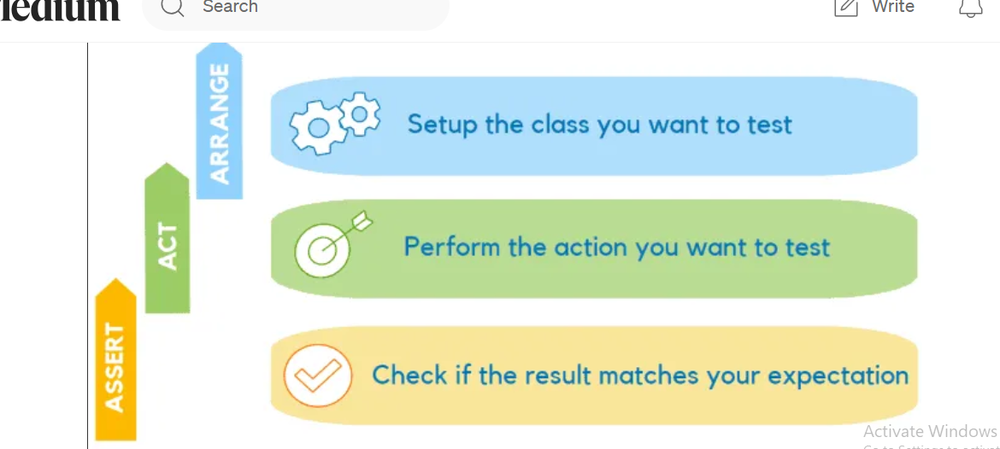

### Xunit testing 



[link available for](https://medium.com/@codebob75/unit-testing-in-c-with-xunit-complete-guide-18ee2b919b05)


  ######  Add xUnit Testing Project
    
In Solution Explorer (Ctrl + Alt + L):

Right-click on the Solution.

Choose Add > New Project.

Select xUnit Test Project (.NET), then click Next.

Provide a name for the test project (e.g., DemoApp.Tests).

Choose the same location as your main project and click Create.

Step 4: Add Required NuGet Packages

##### Open the NuGet Package Manager:

Right-click on your test project (DemoApp.Tests) in Solution Explorer.

Select Manage NuGet Packages.

Install the following packages:


xunit: Provides the xUnit testing framework.

xunit.runner.visualstudio: Enables Visual Studio to discover and run tests.

(Optional) Moq: For creating mock objects in tests.

Step 5: Write Code to Test

Open the Program.cs file in your main project (DemoApp).

Add a simple class to test:
```
namespace DemoApp
{
    public class Calculator
    {
        public int Add(int a, int b) => a + b;
    }
}
```

##### Write Test Cases
In the DemoApp.Tests project, open the UnitTest1.cs file (created by default).
Replace the contents with the following:
```
using Xunit;
using DemoApp;

namespace DemoApp.Tests
{
    public class CalculatorTests
    {
        [Fact]
        public void Add_ReturnsCorrectSum()
        {
            // Arrange
            var calculator = new Calculator();

            // Act
            var result = calculator.Add(2, 3);

            // Assert
            Assert.Equal(5, result);
        }
    }
}
```
##### Run Tests

Open the Test Explorer:

Go to Test > Test Explorer in the top menu.

Alternatively, press Ctrl + E, T.
Click the Run All Tests button (green play icon).

The test results will appear, showing whether the test passed or failed.

#####  Debug a Failing Test (Optional)

If a test fails, click the Debug button in the Test Explorer.
Visual Studio will open the test code and allow you to step through it line by line.
##### Organize Your Tests

Create separate test files for each class in your main project (e.g., CalculatorTests.cs).

Group related tests into test methods.

##### Best Practices

Use descriptive test names.
Write one assertion per test to ensure clarity.
Mock dependencies using libraries like Moq when testing classes with external dependencies.
Folder and Namespace Structure
Here’s what your solution should look like:


### error fix

Steps to Fix the Issue
Add Project Reference

###### In Solution Explorer:

* Right-click on the DemoApp.Tests project.

* Select Add > Project Reference.

* In the dialog box, check the box next to your main project (DemoApp).
Click OK.

* Update the Using Directive

In your CalculatorTests.cs file, ensure you include the namespace of the Calculator class:


* using DemoApp; // Ensure this matches your main project's namespace
Rebuild the Solution

* Go to the Build menu and select Rebuild Solution.

